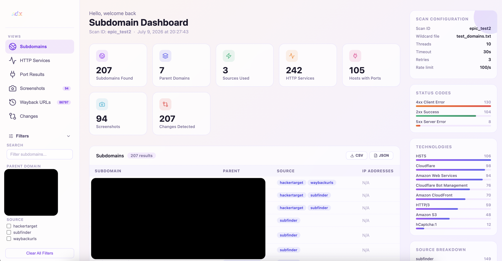
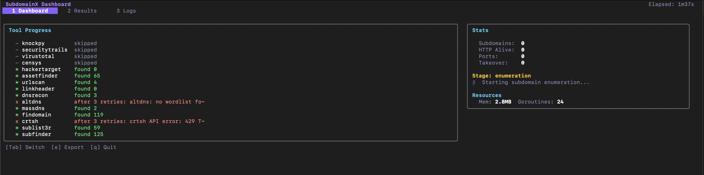

<div align="center">
  
  <h1>SubdomainX</h1>
  <p><strong>Advanced Subdomain Discovery & Security Reconnaissance Tool</strong></p>
</div>

<div align="center">

[](https://golang.org)
[](LICENSE)
[](https://goreportcard.com/report/github.com/itszeeshan/subdomainx)
[](https://pkg.go.dev/github.com/itszeeshan/subdomainx)
[](https://github.com/itszeeshan/subdomainx/releases)
[](https://github.com/itszeeshan/subdomainx/stargazers)
[](https://github.com/itszeeshan/subdomainx/network)
[](https://github.com/itszeeshan/subdomainx/issues)
[](https://github.com/itszeeshan/subdomainx/pulls)
[](https://github.com/itszeeshan/subdomainx/actions)
[](https://github.com/itszeeshan/subdomainx)

</div>

SubdomainX combines 12+ enumeration tools and 6+ API services into a single CLI. Run one command and get results from subfinder, amass, crt.sh, SecurityTrails, VirusTotal, and more — deduplicated and ready to use.

## Install

```bash
go install github.com/itszeeshan/subdomainx/v2@latest
```

Or [download a pre-built binary](https://github.com/itszeeshan/subdomainx/releases) from the releases page.

## Usage

```bash
# Enumerate subdomains with subfinder + HTTP probing
subdomainx --subfinder --httpx example.com

# Multiple tools + API sources
subdomainx --subfinder --amass --crtsh --securitytrails --virustotal example.com

# Multiple domains from a file
subdomainx --wildcard domains.txt --format html

# Export to security tools
subdomainx --subfinder --httpx --format burp example.com   # Also: zap, nessus, csv
```

> Flags go before the domain: `subdomainx --subfinder example.com`

## Features

**Enumeration** — subfinder, amass, findomain, assetfinder, sublist3r, knockpy, dnsrecon, fierce, massdns, altdns, waybackurls, linkheader

**API Sources** — SecurityTrails, VirusTotal, Censys, crt.sh, URLScan.io, HackerTarget

**Scanning** — HTTP probing via httpx, port scanning via smap

**Screenshots** — Capture screenshots of discovered subdomains with `--screenshot`

**Tech Fingerprinting** — Detect technologies running on subdomains with `--tech`

**Takeover Detection** — Check for subdomain takeover vulnerabilities with `--takeover`

**Diff/Monitoring** — Compare scans over time with `--diff` to track changes

**Notifications** — Get alerts via Slack, Discord, Telegram, or Email with `--notify`

**Interactive TUI** — Real-time dashboard with `--tui`

**REST API Server** — Run as an API server with `subdomainx serve`

**Reports** — HTML, JSON, TXT, CSV, plus Burp Suite, Nessus, and OWASP ZAP formats

**Checkpointing** — Resume interrupted scans with `--resume`

<div align="center">
  
  <p><em>Interactive HTML report</em></p>
</div>
<div align="center">
  
  <p><em>Interactive TUI Dashboard</em></p>
</div>

## Documentation

**[subdomainx.vercel.app](https://subdomainx.vercel.app)**

- [Installation](https://subdomainx.vercel.app/installation)
- [CLI Reference](https://subdomainx.vercel.app/cli-reference)
- [REST API Server](https://subdomainx.vercel.app/api-server)
- [Examples](https://subdomainx.vercel.app/examples)
- [Configuration](https://subdomainx.vercel.app/configuration)
- [Deployment](https://subdomainx.vercel.app/deployment)
- [Supported Tools](https://subdomainx.vercel.app/supported-tools)

## Contributing

We welcome contributions! Here's how you can help:

1. **Report Bugs**: [Create an issue](https://github.com/itszeeshan/subdomainx/issues)
2. **Suggest Features**: [Start a discussion](https://github.com/itszeeshan/subdomainx/discussions)
3. **Submit PRs**: Fork the repo and submit pull requests
4. **Improve Docs**: Help us make the documentation better
5. **Star the Repo**: Show your support!

### Development Setup

```bash
git clone https://github.com/itszeeshan/subdomainx.git
cd subdomainx
go mod download && go build -o subdomainx .
```

## License

MIT — see [LICENSE](LICENSE).

**SubdomainX is designed for authorized security testing and research purposes only.**

- Always ensure you have proper authorization before scanning any domain
- Respect rate limits and terms of service of target systems
- Use responsibly and ethically
- The authors are not responsible for any misuse of this tool

## Acknowledgments

- All the amazing open-source tools that make SubdomainX possible
- The security community for continuous feedback and improvements
- Contributors and users who help make this tool better

---

<div align="center">
  <p><strong>Happy Hunting! 🎯</strong></p>
  <p>Made with ❤️ by Zeeshan</p>
</div>
